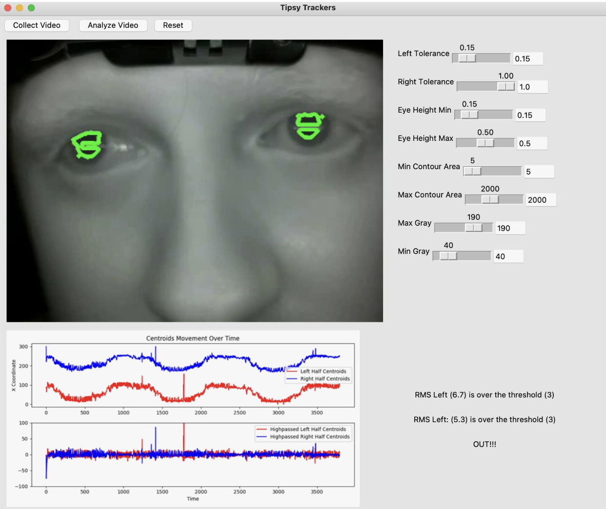

# Tipsy Trackers

### Overview

The Tipsy Tracker project is aimed at developing a device to detect nystagmus. The horizontal gaze nystagmus test is administered by law enforcement agents during traffic stops when a driver is suspected to be under the influence of alcohol. However, the test is highly qualitative in nature, and observed nystagmus can be the result of eye muscle fatigue, certain medications, illness, or improper administration of the test. Consequently, the test as it is currently administered may be an ineffective method to screen for inebriation. The goal of our project is to design a device that accurately detects nystagmus, i.e. erratic departures from “smooth pursuit” eye tracking, and the angle to the centerline at which such movement occurs in order to determine if the onset of nystagmus test correlates with blood alcohol content (BAC). If a correlation does exist, our device could be easily used by drivers and law enforcement agents alike to ensure roadway users are within the legal limit. If a correlation does not exist, our design could end an erroneous practice that falsely identifies drunk drivers.

The breakdown of smooth pursuit, the onset of distinct (large amplitude) and sustained (>4sec) gaze nystagmus at maximum lateral deviation, and nystagmus before 45° of lateral deviation are “clues” that when taken together indicate inhebriation. However, this practice in the field is highly controversial as nystagmus can be caused by many benign factors as well. 




### Features
- Video capture and processing to detect eye movements.
- Analysis of eye movement data to extract meaningful metrics.
- Remote execution of scripts on a Raspberry Pi for video capture and analysis.
- Visualization of eye tracking data and metrics through a graphical user interface (GUI).

### Repository Structure
- engine/: Contains core algorithms for video processing and eye movement analysis.
- experiments/: Scripts for testing and experimenting with different algorithms and parameters.
- interface/: GUI application for interacting with the eye tracker system, including video playback and parameter tuning.
- raspberry.sh: Shell script for remote execution of tasks on a Raspberry Pi.

### Key Scripts
- engine/analysis.py: Processes video to detect eye movements and calculates metrics.
- interface/interface.py: Main GUI application for system interaction.
- interface/test.py: Script for testing remote execution and video collection.
- experiments/binary_video_v1.py, experiments/contours_v1.py: Experimental scripts for algorithm development.

## Getting Started
1. Clone the repository on your local machine.
2. Install the required Python packages:
```bash
pip install -r requirements.txt
```

### Configuration
Create a .env file in the root directory based on the .env.template provided. This file should contain necessary environment variables such as Raspberry Pi credentials and paths. Example .env content:
```bash
RASPBERRY_PI_USERNAME=pi
RASPBERRY_PI_IP_ADDR=192.168.1.100
RASPBERRY_PI_LOCAL_ENV=/path/to/virtualenv
RASPBERRY_PI_SCRIPT_LOC=/path/to/script.py
RASPBERRY_PI_VIDEO_NAME=video.mp4
LOCAL_FILE_SAVE=/local/path
```

### Running the Application
To start the GUI application, navigate to the interface/ and run:
```bash
python interface.py
```

## Contributing
Contributions to the Tipsy Tracker project are welcome. Please ensure to follow the coding standards and submit pull requests for any new features or bug fixes.

### Special Thanks
We thank Dr. Hafeez Dhalla and Amit Naranwe of the Fitzpatric Institute of Photonics for sponsoring this work as part of the BME436 Senior Design Class in Biophotonics.

### License
This project is licensed under the MIT License - see the LICENSE file for details.